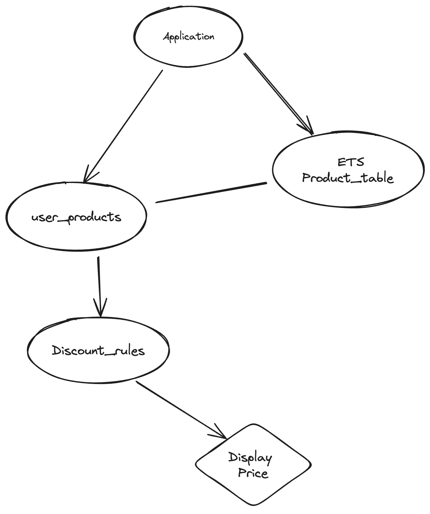
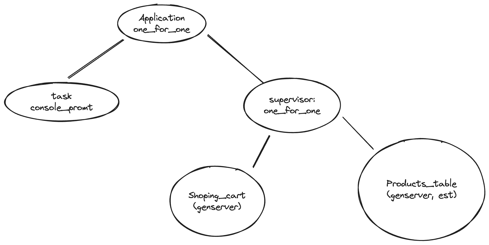

# KantoxMarket

Interview procces for kantox.

## Run the app

### Locally
```bash
MIX_ENV=prod mix run --no-halt
```
this option will need to have locally installed elixir, at least `1.15` and otp at least `26`

### with docker
```bash
docker build -t kantox_market .
```

once it is build run

```bash
docker run -it --rm kantox_market
```

## Analysis

### Facts
- the core idea is **add**  products and is able to display the total price.
- there can be discounts based on some conditions, that are:
    - buy-one-get-one-free offers and of green tea: this mathematically means
that if the item list is pair, the checkout will be the half of the price,
    - if not will be the half of the size plus one item.
        If you buy 3 or more strawberries, the price should drop to £4.50 per strawberry (pretty straightforward)
    - If you buy 3 or more coffees, the price of all coffees should drop to two thirds of the original price(pretty straightforward).
- Our check-out can scan items in any order, and because the CEO and COO change their minds often, it needs to be flexible regarding our pricing rules: this means
that we will need to add the ability to quickly change or add Business rules

### scope
- elixir
- tests
- no db

### Questions?:
- Will the final user will need the detail?
- how many user will be?
- is the program installed in each cash register, or is the cashier or each cash
machine going to communicate with us somehow?
- what will happen if a a new rule overlaps another rule.
- if the cashier goes down, do we need to recover the state?
- is the cashier going to input the whole input or only the codes?
  - R: for e-zness I decided that the cashier only enters the code
- if error in the code, should it break or should continue?
  -R: I decided to ignore the code and continue.


### Tasks and considerations
- [x] parse the input and verify that the code is our ets table.
- [x] use money, ex_money to handle the currency
- [x] we need the ability to quickly add rules
- [x] think and create cases that could break the checkout system. (a very long value) see how it behaves.

### nice to have:
- [ ] specs
- [ ] docs
- [x] dockerize


### Design
#### Initial design


#### Current Architecture



